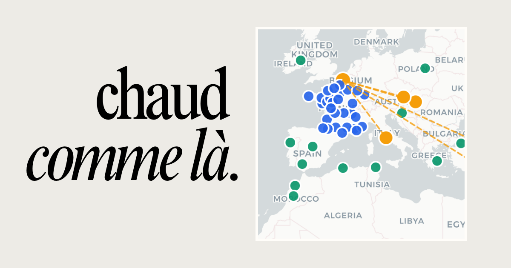

# Chaud comme là

**Quand il fait 38°C à Lille, où dans le monde est-ce la normale ?**

Une carte interactive qui trouve les jumeaux climatiques de vos villes françaises — les endroits dans le monde où il fait exactement pareil aujourd'hui.



## Comment ça fonctionne

- Cliquez sur une ville française (bleue) pour voir ses jumeaux climatiques mondiaux (verts)
- La comparaison se base sur le **ressenti maximal journalier** — plus représentatif que la température brute
- Les jumeaux sont les villes dont le ressenti est identique à **±4°C près**
- Les données météo sont récupérées via [Open-Meteo](https://open-meteo.com/) et rafraîchies toutes les **24h**

## Stack

- [Next.js](https://nextjs.org/) (App Router, ISR)
- [Leaflet](https://leafletjs.com/) via `react-leaflet`
- [Tailwind CSS](https://tailwindcss.com/)
- [Open-Meteo](https://open-meteo.com/) — API météo libre et gratuite, sans clé

## Lancer en local

```bash
npm install
npm run dev
```

L'application sera disponible sur [http://localhost:3000](http://localhost:3000).

Aucune variable d'environnement requise — Open-Meteo est public et sans authentification.

## Données

- **36 villes françaises** — `data/cities-fr.json`
- **30 villes mondiales** — `data/cities-world.json`

Les fichiers JSON contiennent uniquement les coordonnées et métadonnées. Les données météo sont récupérées dynamiquement au runtime.

## Licence

[MIT](LICENSE)
