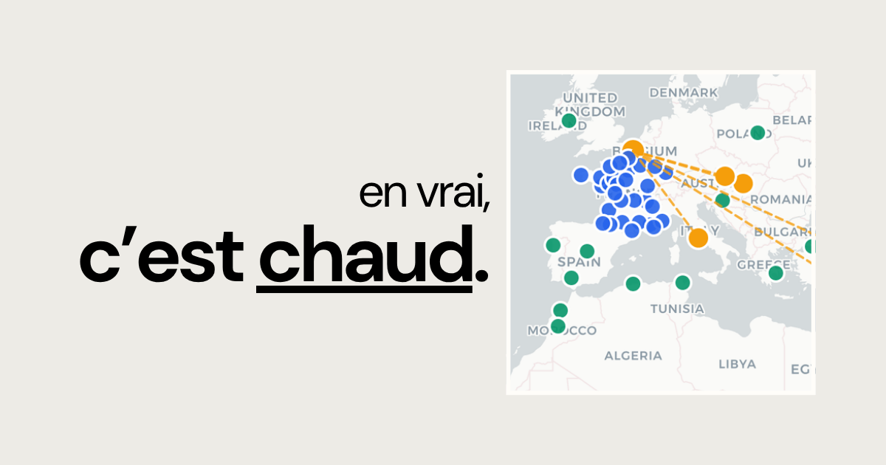

# cestchaud.fr

**Quand Bordeaux atteint 34°C, où dans le monde est-ce la normale ?**

cestchaud.fr visualise le ressenti thermique du jour dans 36 villes françaises et 30 villes mondiales, calcule leurs "jumeaux climatiques", et projette l'évolution de la chaleur jusqu'en 2050 selon les modèles GIEC.



---

## Ce que fait le site

- **Carte interactive** — ressenti max du jour pour chaque ville, colorée par intensité
- **Jumeaux climatiques** — cliquer une ville française affiche les villes du monde où il fait pareil aujourd'hui (± 4°C)
- **Fiche ville** — pour chaque ville française : ressenti, anomalie vs. normale ERA5, tendance sur 30 ans, projections GIEC 2030/2040/2050
- **Vue France** — classement des 36 villes, narrative éditoriale générée, top 6 les plus exposées selon le GIEC
- **Pas d'IA générative** — toutes les données viennent de sources scientifiques ouvertes, rien n'est inventé

---

## Sources de données

| Source | Usage |
|--------|-------|
| [Open-Meteo](https://open-meteo.com/) | Ressenti max journalier (`apparent_temperature_max`) - gratuit, sans clé |
| [ERA5 / ECMWF](https://www.ecmwf.int/en/forecasts/dataset/ecmwf-reanalysis-v5) | Normales climatiques 1991-2020, tendance observée sur 30 ans |
| [CMIP6 / GIEC AR6](https://www.ipcc.ch/report/ar6/wg1/) | Projections 2030, 2040, 2050 - scenario SSP2-4.5 |

Les données ERA5 et CMIP6 sont précalculées et stockées dans `data/climate.json`. Les données météo temps réel sont récupérées à chaque build via `npm run fetch-weather`.

---

## Stack technique

- **[Next.js](https://nextjs.org/)** - App Router, ISR (`revalidate = 86400`)
- **[Tailwind CSS v4](https://tailwindcss.com/)** - styles et layout bento
- **[Leaflet](https://leafletjs.com/)** - carte interactive (tiles Carto light)
- **[Resend](https://resend.com/)** - formulaire de contact
- **[Vercel](https://vercel.com/)** - hébergement et déploiement continu

---

## Architecture

```
app/
  page.tsx              # Accueil - carte + bento panel
  en/france/page.tsx    # Vue d'ensemble France
  a/[slug]/page.tsx     # Fiche ville (36 pages statiques)
  a-propos/page.tsx     # Methodologie et sources
  contact/page.tsx      # Formulaire de contact
  api/contact/route.ts  # API Resend

components/
  ClientPage.tsx        # Carte + bento interactif (client)
  Map.tsx               # Leaflet carte monde
  CityMap.tsx           # Leaflet carte ville unique
  CityPanel.tsx         # Panel detail ville (carte monde)
  SiteHeader.tsx        # Header avec date du jour
  ContactForm.tsx       # Formulaire avec honeypot

data/
  cities-fr.json        # 36 villes françaises (coords + region)
  cities-world.json     # 67 villes mondiales (coords + climat)
  climate.json          # Normales ERA5 + projections CMIP6 par ville/mois
  weather-cache.json    # Cache météo généré au build (gitignore)

scripts/
  fetch-weather.mjs     # Récupère Open-Meteo pour toutes les villes
```

---

## Lancer en local

```bash
npm install

# Récupère les données météo (requis avant le build)
npm run fetch-weather

# Dev
npm run dev

# Build
npm run build
```

L'application est disponible sur [http://localhost:3000](http://localhost:3000).

### Variables d'environnement

| Variable | Usage |
|----------|-------|
| `RESEND_API_KEY` | Envoi des emails via le formulaire de contact |

---

## Déploiement

La commande de build Vercel est :

```
npm run fetch-weather && next build --webpack
```

---

## Securite formulaire de contact

- Rate limit : 3 requetes par minute par IP
- Honeypot : champ masque, rejet silencieux si rempli (cote client + API)
- Validation : longueur, format email, taille payload

---

## Pages et URLs

| URL | Description |
|-----|-------------|
| `/` | Accueil - carte interactive + jumeaux climatiques |
| `/en/france` | Vue d'ensemble chaleur en France |
| `/a/[ville]` | Fiche climatique par ville (ex: `/a/bordeaux`) |
| `/a-propos` | Methodologie, sources, outils |
| `/contact` | Formulaire de contact |
| `/mentions-legales` | Mentions legales |

---

## Auteur

[Florent Bertiaux](https://leswww.com) - creatif technologique, France.

> Ce projet est ne de la conviction que les donnees climatiques meritent d'etre lues autrement, sans jargon et sans filtre.
